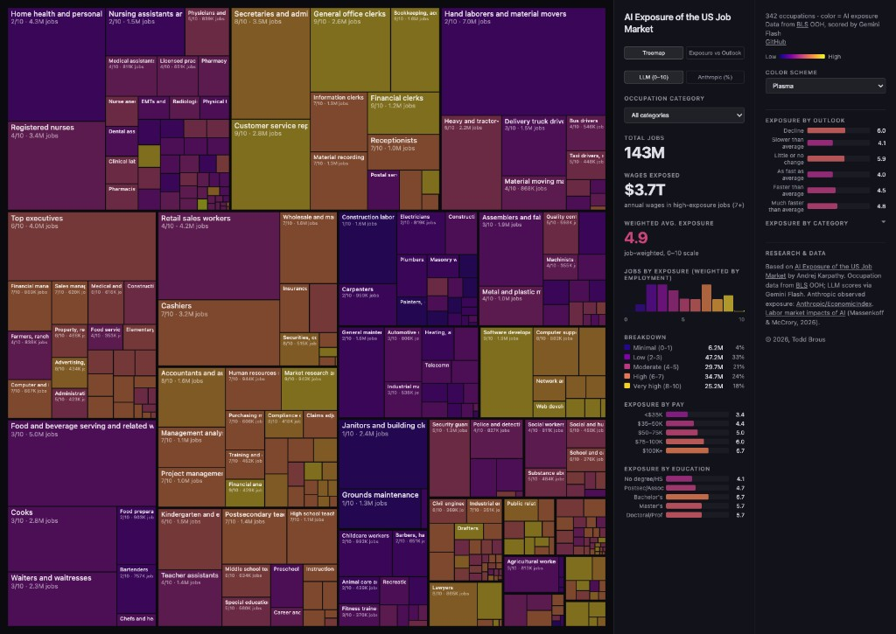

# AI Exposure of the US Job Market

Analyzing how susceptible every occupation in the US economy is to AI and automation, using data from the Bureau of Labor Statistics [Occupational Outlook Handbook](https://www.bls.gov/ooh/) (OOH).

**Live demo: [karpathy.ai/jobs](https://karpathy.ai/jobs/)**



## What's here

This clone uses **pre-included data**: `occupations.csv`, `scores.json`, and `docs/data.json` are already in the repo. Scraping and LLM scoring are **skipped** unless you choose to run the full pipeline (see Setup/Usage below).

The BLS OOH covers **342 occupations** spanning every sector of the US economy, with detailed data on job duties, work environment, education requirements, pay, and employment projections. We scraped all of it, scored each occupation's AI exposure using an LLM, and built an interactive treemap visualization.

## Data pipeline

1. **Scrape** (`scrape.py`) — Playwright (non-headless, BLS blocks bots) downloads raw HTML for all 342 occupation pages into `html/`.
2. **Parse** (`parse_detail.py`, `process.py`) — BeautifulSoup converts raw HTML into clean Markdown files in `pages/`.
3. **Tabulate** (`make_csv.py`) — Extracts structured fields (pay, education, job count, growth outlook, SOC code) into `occupations.csv`.
4. **Score** (`score.py`) — Sends each occupation's Markdown description to an LLM (Gemini Flash via OpenRouter) with a scoring rubric. Each occupation gets an AI Exposure score from 0-10 with a rationale. Results saved to `scores.json`.
5. **Build site data** (`build_site_data.py`) — Merges CSV stats and AI exposure scores into a compact `docs/data.json` for the frontend.
6. **Website** (`docs/index.html`) — Interactive treemap visualization where area = employment and color = AI exposure (green to red).

## Key files

| File | Description |
|------|-------------|
| `occupations.json` | Master list of 342 occupations with title, URL, category, slug |
| `occupations.csv` | Summary stats: pay, education, job count, growth projections |
| `scores.json` | AI exposure scores (0-10) with rationales for all 342 occupations |
| `prompt.md` | All data in a single file, designed to be pasted into an LLM for analysis |
| `html/` | Raw HTML pages from BLS (source of truth, ~40MB) |
| `pages/` | Clean Markdown versions of each occupation page |
| `docs/` | Static website (treemap visualization), deployable to GitHub Pages |
| `data/job_exposure.csv` | Anthropic observed exposure by SOC (from [Anthropic/EconomicIndex](https://huggingface.co/datasets/Anthropic/EconomicIndex)) |
| `merge_anthropic_exposure.py` | Merges Anthropic exposure into `docs/data.json` by SOC match |

## AI exposure scoring

Each occupation is scored on a single **AI Exposure** axis from 0 to 10, measuring how much AI will reshape that occupation. The score considers both direct automation (AI doing the work) and indirect effects (AI making workers so productive that fewer are needed).

A key signal is whether the job's work product is fundamentally digital — if the job can be done entirely from a home office on a computer, AI exposure is inherently high. Conversely, jobs requiring physical presence, manual skill, or real-time human interaction have a natural barrier.

**Calibration examples from the dataset:**

| Score | Meaning | Examples |
|-------|---------|---------|
| 0-1 | Minimal | Roofers, janitors, construction laborers |
| 2-3 | Low | Electricians, plumbers, nurses aides, firefighters |
| 4-5 | Moderate | Registered nurses, retail workers, physicians |
| 6-7 | High | Teachers, managers, accountants, engineers |
| 8-9 | Very high | Software developers, paralegals, data analysts, editors |
| 10 | Maximum | Medical transcriptionists |

Average exposure across all 342 occupations: **5.3/10**.

## Visualization

The main visualization is an interactive **treemap** where:
- **Area** of each rectangle is proportional to employment (number of jobs)
- **Color** indicates AI exposure on a green (safe) to red (exposed) scale
- **Layout** groups occupations by BLS category
- **Hover** shows detailed tooltip with pay, jobs, outlook, education, exposure score, and LLM rationale

## LLM prompt

[`prompt.md`](prompt.md) packages all the data — aggregate statistics, tier breakdowns, exposure by pay/education, BLS growth projections, and all 342 occupations with their scores and rationales — into a single file (~45K tokens) designed to be pasted into an LLM. This lets you have a data-grounded conversation about AI's impact on the job market without needing to run any code. Regenerate it with `uv run python make_prompt.py`.

## Setup

**Python (uv):** This project uses [uv](https://docs.astral.sh/uv/) for the virtual environment. From the repo root:

```bash
uv sync
```

All Python commands (including `merge_anthropic_exposure.py`, `build_site_data.py`, etc.) should be run with `uv run python <script>` so they use the project’s dependencies. No need to activate a venv manually.

If you run the full pipeline (scrape + score), also install Playwright and set an API key:

```bash
uv run playwright install chromium
```

Requires an OpenRouter API key in `.env`:
```
OPENROUTER_API_KEY=your_key_here
```

## Usage

```bash
# Optional: merge Anthropic observed exposure into docs data (run once; uses data/job_exposure.csv)
uv run python merge_anthropic_exposure.py

# Scrape BLS pages (only needed once, results are cached in html/)
uv run python scrape.py

# Generate Markdown from HTML
uv run python process.py

# Generate CSV summary
uv run python make_csv.py

# Score AI exposure (uses OpenRouter API)
uv run python score.py

# Build website data
uv run python build_site_data.py

# Serve the site locally
cd docs && python -m http.server 8000
```

## Pushing to your own GitHub repo

This project was cloned (not forked). To push to your own repository:

1. Create a new repository on GitHub (e.g. `ai-jobs-exposure`).
2. Add it as the remote and push (replace `YOUR_USER` and repo name as needed):

   ```bash
   git remote add origin https://github.com/YOUR_USER/ai-jobs-exposure.git
   git branch -M main
   git push -u origin main
   ```

The existing `.gitignore` excludes `.env`, `__pycache__/`, `.venv`, and `pages/`. Keep it as-is unless you want to exclude more (e.g. `html/` if you re-scrape and don’t want to commit it).

## GitHub Pages

The static site lives in `docs/` so you can deploy it with **Deploy from a branch** (no Actions needed):

1. Push the repo to GitHub.
2. In the repo go to **Settings → Pages**.
3. Under **Build and deployment**, set **Source** to **Deploy from a branch**.
4. Choose branch **main** (or your default branch) and folder **/docs**, then Save.

The site will be available at `https://<owner>.github.io/<repo>/`. After you regenerate data, run `uv run python build_site_data.py` (and optionally `uv run python merge_anthropic_exposure.py`), commit the updated `docs/data.json`, and push to refresh the live site.

**Node/npm:** The site is static (single HTML + JS); no build step or npm is required. If you later add a frontend build (e.g. Vite) or dev server, add a `package.json` and put `node_modules/` in `.gitignore`.
